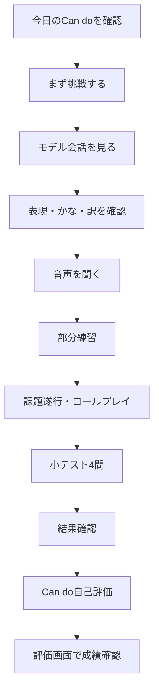
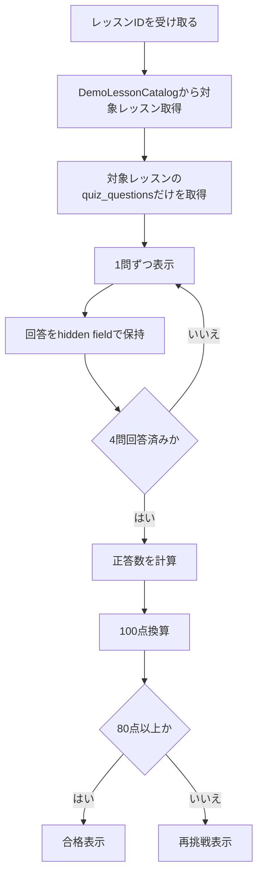
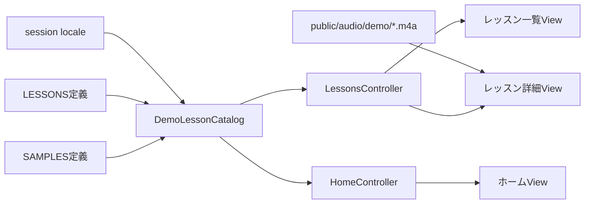
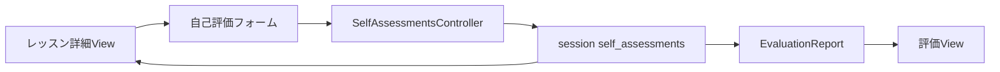
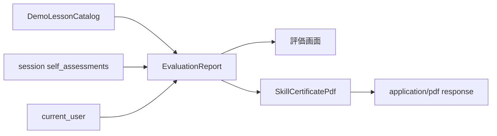
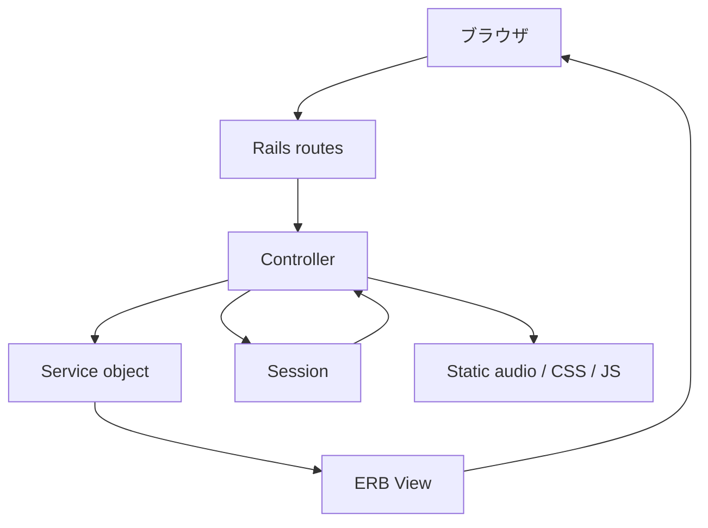

# しごと日本語 / Work Nihongo v1.00 設計書

作成日: 2026-09-08  
対象リリース: v1.00  
対象コミット: `6274a08 fix: merge progress into evaluation`  
公開URL: `https://jpschool-7cobj7xvjq-ew.a.run.app`

## 1. 目的

本書は、v1.00時点のWebアプリとして提供している機能、画面遷移、データの流れを明確にするための設計書です。

正本要件は `SPEC.md`、開発ルールは `AGENTS.md` に従います。v1.00は、外国人労働者向けのCan do型日本語学習Webアプリの公開プロトタイプです。

## 2. v1.00の位置づけ

v1.00は、次の学習体験を確認できる公開プロトタイプです。

- 職場場面別の12レッスンを表示する。
- 各レッスンにCan do、モデル表現、会話例、音声、練習、ロールプレイ、自己評価を表示する。
- 小テストを各レッスン4問で実施する。
- 評価画面で完了、理解テスト、Can do自己評価、最高点を確認する。
- 評価画面からWeb学習記録としてのスキル証書PDFを取得する。
- 日本語、英語、ベトナム語、中国語のUI表示を切り替える。

v1.00は正式な日本語能力認定、会社の正式な安全教育、法定教育の代替ではありません。PDF証書もWeb学習記録であり、公的な能力認定ではありません。

## 3. 技術構成

| 項目 | 内容 |
|---|---|
| フレームワーク | Ruby on Rails |
| 画面方式 | サーバーサイドレンダリングHTML |
| UI補助 | Hotwire / Turbo / Stimulus想定、Sprockets、Tailwind CSS |
| 言語切替 | Rails I18n |
| 認証 | Google OAuth、Rails session |
| 教材ソース | `DemoLessonCatalog`、`db/content/common_workplace.yml`、静的音声ファイル |
| 音声 | `public/audio/demo/*.m4a` |
| PDF | `SkillCertificatePdf` によるアプリ内生成 |
| デプロイ | Google Cloud Run |
| テスト | Minitest |

## 4. 主要機能

### 4.1 学習者向け

| 機能 | URL | 主な内容 |
|---|---|---|
| ホーム | `/` | 次に学ぶレッスン、復習件数、学習概要 |
| レッスン一覧 | `/lessons` | 12レッスン、Can do概要、所要時間、状態 |
| レッスン詳細 | `/lessons/:id` | Can do、音声、会話例、練習、ロールプレイ、自己評価 |
| 小テスト | `/lessons/:lesson_id/quiz` | レッスン別4問の理解テスト |
| 結果 | `/lessons/:lesson_id/results` | 点数、合否、再挑戦、次レッスン |
| 復習 | `/review` | 誤答復習のデモUI |
| 評価 | `/evaluation` | 成績サマリー、Can do別評価、PDF取得 |
| 設定 | `/settings` | 表示言語、パスワード、ログアウトのデモUI |
| 進捗互換URL | `/progress` | `/evaluation` へリダイレクト |

### 4.2 管理者向け

| 機能 | URL | 主な内容 |
|---|---|---|
| 管理ダッシュボード | `/admin` | 管理概要 |
| 利用者 | `/admin/users` | 利用者一覧デモ |
| 教材 | `/admin/lessons` | 教材一覧・プレビュー導線デモ |
| 管理者進捗 | `/admin/progress` | 管理者向け進捗一覧デモ |

## 5. 画面遷移フローチャート

```mermaid
flowchart TD
  Start([利用開始]) --> Home[ホーム /]
  Home --> Lessons[レッスン一覧 /lessons]
  Home --> NextLesson[次に学ぶレッスン /lessons/:id]
  Home --> Review[復習 /review]
  Home --> Evaluation[評価 /evaluation]

  Lessons --> LessonDetail[レッスン詳細 /lessons/:id]
  LessonDetail --> Quiz[小テスト /lessons/:id/quiz]
  LessonDetail --> SelfAssessment[Can do自己評価を保存]
  SelfAssessment --> LessonDetail

  Quiz --> NextQuestion{次の問題があるか}
  NextQuestion -->|ある| Quiz
  NextQuestion -->|ない| Result[結果 /lessons/:id/results]

  Result --> Retry[再挑戦]
  Retry --> Quiz
  Result --> NextLesson2[次のレッスン]
  NextLesson2 --> LessonDetail
  Result --> Lessons

  Evaluation --> Certificate[スキル証書PDF /evaluation/certificate.pdf]
  Review --> Lessons
  Settings[設定 /settings] --> Home
  Progress[/progress] --> Evaluation
```

## 6. レッスン内学習フロー



## 7. 小テストフロー



## 8. データフローチャート

### 8.1 教材表示データフロー



### 8.2 自己評価データフロー



### 8.3 評価・PDFデータフロー



### 8.4 リクエスト処理データフロー



## 9. 主要コンポーネント

| コンポーネント | 役割 |
|---|---|
| `ApplicationController` | locale、Google認証、管理者認可、デモユーザー、教材取得、自己評価取得の共通処理 |
| `DemoLessonCatalog` | 12レッスン、Can do、フレーズ、会話、音声パス、小テストを生成 |
| `QuizzesController` | レッスン別小テストの表示、回答保持、採点 |
| `SelfAssessmentsController` | Can do自己評価の保存・更新 |
| `EvaluationsController` | 評価画面とPDF証書の出力 |
| `EvaluationReport` | 完了数、合格数、自己評価数、最高点、平均点、レッスン別評価を集計 |
| `SkillCertificatePdf` | Web学習記録PDFを生成 |
| `Content::Validator` | 教材YAMLの整合性検証 |

## 10. v1.00時点のデータ保持

| データ | 保存場所 | 備考 |
|---|---|---|
| レッスン一覧 | `DemoLessonCatalog::LESSONS` | デモ用固定データ |
| フレーズ・翻訳 | `DemoLessonCatalog::SAMPLES` | UI localeに応じて表示 |
| 音声 | `public/audio/demo/*.m4a` | 12レッスン x 2フレーズ |
| 小テスト | `DemoLessonCatalog#build_quiz_questions` | 各レッスン4問を生成 |
| 利用者 | Google OAuth + Rails session | 利用者DBは持たない |
| 管理者・停止設定 | 環境変数 | `GOOGLE_ADMIN_EMAILS`、`GOOGLE_STOPPED_EMAILS` |
| 自己評価 | Rails session | ログインセッション内に保存 |
| 評価集計 | `EvaluationReport` | 固定教材とセッション自己評価から生成 |
| PDF | レスポンス時に動的生成 | ファイル保存はしない |
| 教材YAML | `db/content/common_workplace.yml` | 検証コマンドの対象 |

## 11. PDF証書の仕様

| 項目 | 内容 |
|---|---|
| URL | `/evaluation/certificate.pdf` |
| Content-Type | `application/pdf` |
| ファイル名 | `work-nihongo-skill-certificate.pdf` |
| 表示内容 | 学習者名、発行日、完了数、理解テスト合格数、自己評価数、最高点、平均点、Can do別サマリー |
| フォント | `HeiseiKakuGo-W5`、`UniJIS-UCS2-H` |
| 注意書き | 公的な日本語能力認定ではないことを明記 |

## 12. 現在の制約

- 小テスト回答、復習履歴、最高点、自己評価は永続DB保存ではありません。
- 管理者と停止アカウントは環境変数のGoogleメール一覧で制御します。
- 管理者機能は画面デモが中心です。
- PDFはv1.00向けの軽量生成であり、デザイン性や複数ページ組版は限定的です。
- 進捗専用画面は削除し、評価画面へ統合しています。

## 13. 次期開発候補

1. Google Workspaceや管理者設定画面と連携し、管理者・停止アカウント制御を運用しやすくする。
2. 必要になった場合だけ、`lesson_attempts`、`quiz_answers`、`review_items` をDBへ本接続する。
3. PDF証書を正式なテンプレート、会社名表示制御、発行番号、複数ページに対応する。
4. 教材レビュー、音声レビュー、公開条件を管理画面へ接続する。
5. 管理者進捗一覧を実データ化する。
6. RuboCop、Brakeman、bundler-auditをGemfileへ追加し、CIで実行する。

## 14. 確認コマンド

v1.00時点の主な確認コマンドは次です。

```sh
bin/rails test
bin/rails content:validate
git diff --check
gcloud run services describe jpschool \
  --project web-serv-493701 \
  --region europe-west1 \
  --format="value(status.latestReadyRevisionName,status.traffic[0].revisionName,status.traffic[0].percent,status.url)"
```
